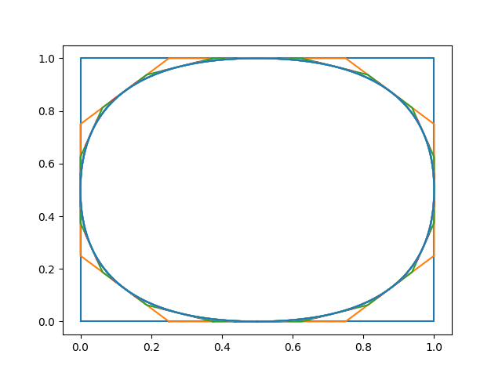
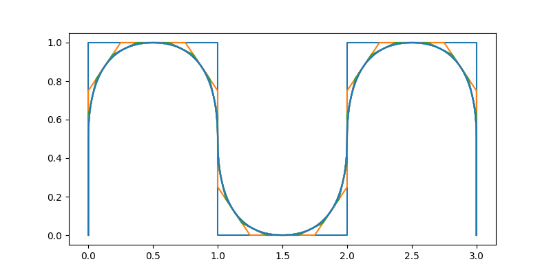
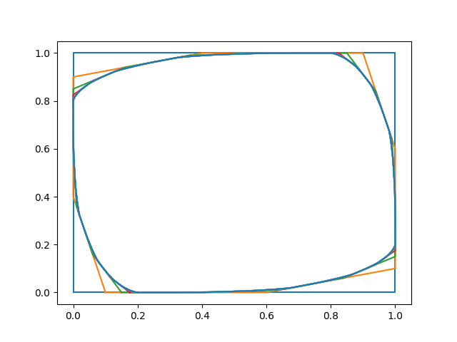
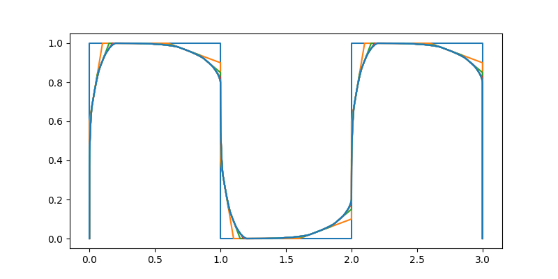
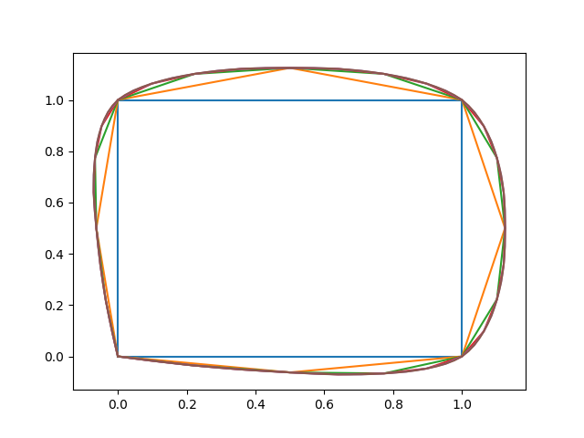
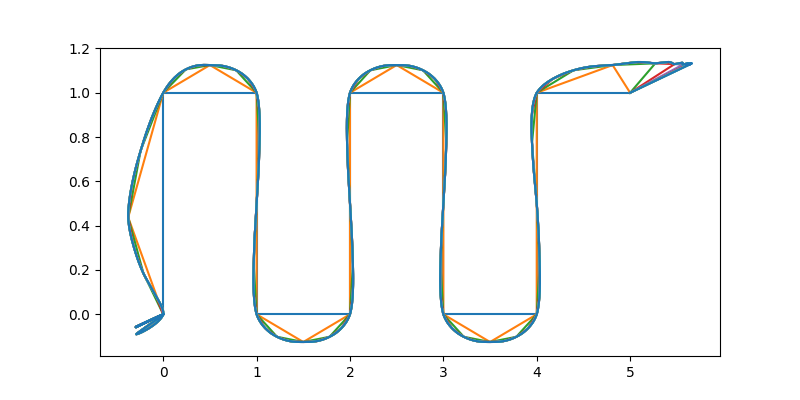

# Subdivision Curves.
* Chaikin's Scheme algorithm
* Corner cutting algorithm
* Four points algorithm

## installation
```
pip install -r requirements
```

## Chaikin's Scheme algorithm



## Corner cutting algorithm



## Four points algorithm



